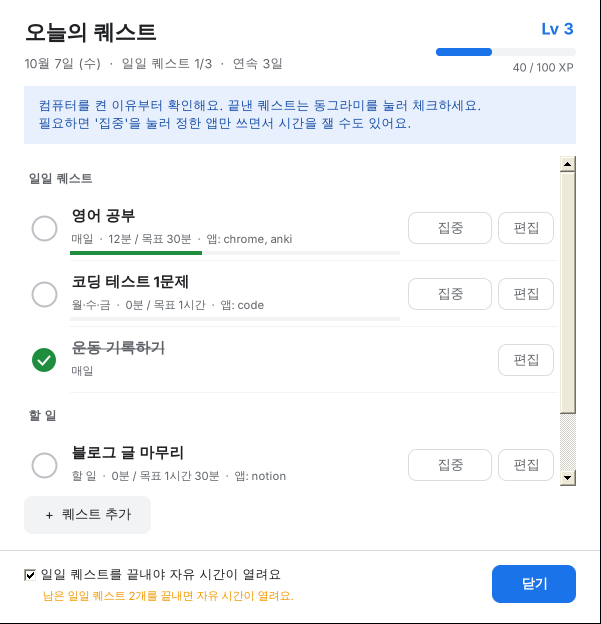
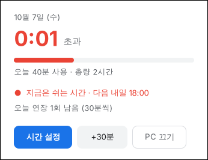
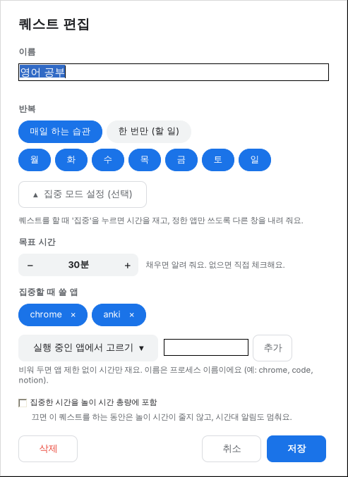
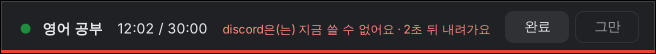
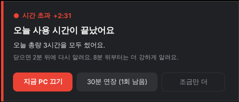
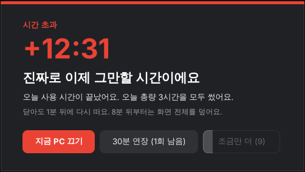
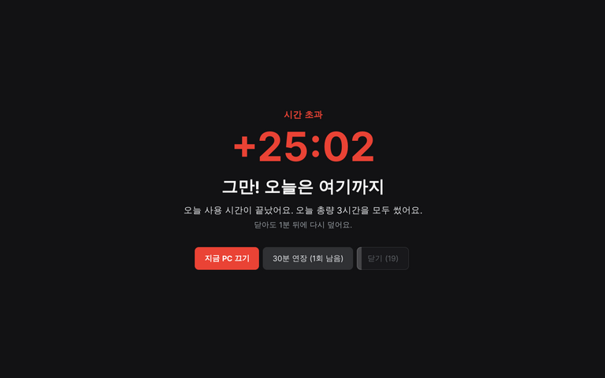

# PlayTimer

PC를 켰으면 **원래 하려던 일부터** 하게 도와주는 윈도우용 습관·시간 관리 앱이에요.

- **오늘의 퀘스트**: 매일 할 습관과 오늘 할 일을 게임 퀘스트처럼 적고 체크해요. 경험치, 레벨, 연속 달성일이 쌓여요.
- **놀이 시간 제한**: 캘린더처럼 요일별로 "하루 몇 시간까지", "몇 시부터 몇 시까지"를 정하고, 시간이 끝나면 강제로 끄지 않고 끄라고 계속 알려요.
- **퀘스트 먼저**: 일일 퀘스트를 끝내야 자유 시간이 열리게 할 수 있어요.
- **집중 모드 (선택)**: 원하는 퀘스트에서만 켜서, 시간을 재고 정한 앱만 쓰도록 다른 창을 내려 줘요.



- 윈도우 10 / 11, 관리자 권한 필요 없음
- 따로 설치할 런타임 없음(윈도우에 기본으로 들어 있는 .NET Framework 사용)

## 설치

셋 중 편한 방법 하나만 하면 돼요. 설치가 끝나면 바로 실행되고, 다음부터는 로그인할 때 자동으로 켜져요.

### 방법 1. PowerShell 한 줄 (가장 쉬움)

1. 시작 버튼을 마우스 오른쪽으로 누르고 **터미널**(또는 **Windows PowerShell**)을 엽니다.
2. 아래 한 줄을 붙여 넣고 Enter를 누릅니다.

```powershell
irm https://raw.githubusercontent.com/APapeIsName/handle-my-pc/HEAD/install.ps1 | iex
```

### 방법 2. zip 파일 내려받기

1. [Releases](https://github.com/APapeIsName/handle-my-pc/releases/latest)에서 `PlayTimer.zip`을 내려받습니다.
2. 압축을 풀고 `install.bat`을 더블클릭합니다.

> "Windows의 PC 보호" 창이 뜨면 **추가 정보 → 실행**을 누르세요. 서명하지 않은 프로그램이라 뜨는 경고예요.
> 압축을 풀기 전에 zip 파일을 오른쪽 클릭 → **속성** → **차단 해제**에 체크하면 경고가 뜨지 않아요.

### 방법 3. 소스에서 직접 빌드

1. 이 페이지 위쪽의 **Code → Download ZIP**으로 내려받아 압축을 풉니다.
2. `install.bat`을 더블클릭합니다. 윈도우 기본 컴파일러로 빌드한 뒤 설치해요.

### 설치되는 곳

| 항목 | 위치 |
|---|---|
| 프로그램 | `%LOCALAPPDATA%\Programs\PlayTimer` |
| 시간표·퀘스트·사용 기록 | `%LOCALAPPDATA%\PlayTimer` |
| 시작 메뉴 | PlayTimer |
| 자동 실행 | 로그인할 때 (현재 사용자만) |

## 사용법

처음 실행하면 **시간 설정** 창이 열려요. 놀이 시간표를 정해 저장하고, 트레이 아이콘을 더블클릭해서 퀘스트를 적어 보세요.

### 하루의 흐름

1. PC를 켜면 **오늘의 퀘스트** 창이 먼저 떠요. 오늘 하려던 일을 확인하세요.
2. 퀘스트를 끝내면 왼쪽 동그라미를 눌러 체크해요. 경험치를 받아요.
3. 일일 퀘스트를 다 끝내면 자유 시간이 열려요. 자유 시간은 시간표(총량·시간대)에 맞춰 재요.
4. 필요할 때만 퀘스트의 **집중** 버튼을 눌러 시간을 재고 딴짓을 막을 수 있어요.

### 트레이 아이콘

작업 표시줄 오른쪽 아래에 남은 시간(분)이 적힌 아이콘이 생겨요. 색으로 상태를 알 수 있어요.
파랑은 여유, 주황은 10분 이하, 빨강은 시간 초과예요.

| 동작 | 하는 일 |
|---|---|
| 클릭 | 오늘 현황 카드 |
| 더블클릭 | 오늘의 퀘스트 |
| 오른쪽 클릭 | 메뉴 (퀘스트, 집중 그만하기, 시간 설정, 연장, PC 끄기, 타이머 종료) |

집중 중에는 아이콘이 초록색이 되고, 목표까지 남은 분(목표가 없으면 집중한 분)이 표시돼요.

아이콘이 `^` 안에 숨어 있다면 작업 표시줄로 끌어다 놓으면 항상 보여요.
시작 메뉴에서 PlayTimer를 다시 실행해도 퀘스트 창이 열려요.



### 퀘스트

**+ 퀘스트 추가**(`Ctrl+N`)로 만들고, 동그라미를 눌러 체크해요.

| 항목 | 설명 |
|---|---|
| 반복 | **매일 하는 습관**(요일 선택) 또는 **한 번만**(할 일). 할 일은 끝낸 다음 날 목록에서 사라져요 |
| 집중 모드 설정 (선택) | 펼치면 아래 세 가지를 정할 수 있어요. 안 써도 퀘스트는 그대로 돼요 |
| ・ 목표 시간 | 집중 모드로 이만큼 채우면 알려 줘요 |
| ・ 집중할 때 쓸 앱 | 집중하는 동안 쓸 수 있는 앱. "실행 중인 앱에서 고르기"로 쉽게 넣을 수 있어요. 비워 두면 앱 제한 없이 시간만 재요 |
| ・ 놀이 시간 총량에 포함 | 켜면 집중한 시간도 놀이 시간으로 쳐요. 끄면 그 시간은 놀이 시간이 줄지 않고 시간대 알림도 멈춰요 (기본: 끔) |



- 퀘스트 하나를 끝내면 **10 XP**, 100 XP마다 레벨이 올라요.
- 그날의 일일 퀘스트를 모두 끝내면 **연속 달성일**이 하루 늘어요. 하루를 건너뛰면 0부터 다시 시작해요.
- 아래쪽 **"일일 퀘스트를 끝내야 자유 시간이 열려요"**를 켜 두면, 남은 일일 퀘스트가 있는 동안에는 자유 시간에도 "퀘스트 먼저" 알림이 떠요. 알림에서 **퀘스트 하기**를 누르면 바로 퀘스트 창으로 가요.

### 집중 모드 (선택)

필요한 퀘스트에서만 쓰는 부가 기능이에요. 퀘스트 줄의 **집중** 버튼을 누르면 시작돼요.



- 화면 위쪽 막대에 퀘스트 이름, 진행 시간, 허용 앱이 보여요. 막대는 끌어서 옮길 수 있어요.
- 허용 앱이 아닌 창을 맨 앞에 띄우면 막대에 경고가 뜨고, **3초 뒤 그 창이 최소화**돼요. 창을 닫거나 앱을 끄지는 않아요.
- 작업 표시줄, 시작 메뉴, 탐색기, 작업 관리자 같은 윈도우 기본 화면은 항상 쓸 수 있어요.
- 집중한 시간을 놀이 시간에 넣을지는 퀘스트마다 정해요. 넣지 않으면 그동안 놀이 시간이 줄지 않고 시간대 알림도 멈춰요. 넣으면 평소처럼 총량·시간대가 적용돼요.
- 집중하는 동안은 "퀘스트 먼저" 알림이 뜨지 않아요.
- **완료**를 누르면 퀘스트가 체크되고, **그만**을 누르면 진행 시간만 저장하고 끝나요.

### 시간 설정

- **하루 총량**: 요일마다 `−` `+`로 30분씩 조절해요. 마우스 휠, 방향키도 돼요.
- **시간대**: 아래 격자를 드래그해서 써도 되는 시간을 칠해요. 칠한 칸에서 드래그를 시작하면 지워져요.
  여러 요일에 걸쳐 끌면 같은 시간대가 한꺼번에 칠해져요.
- **요일 메뉴**: 요일 이름을 누르면 그 요일을 통째로 칠하거나 지우고, 평일·주말·모든 요일에 복사할 수 있어요.
- **빠른 설정**: 예시 시간표(평일 저녁 2시간, 주말 4시간), 시간대 제한 없애기, 처음 상태로 되돌리기.
- `Ctrl+S` 저장, `Esc` 닫기. 저장하지 않고 닫으려 하면 물어봐요.

총량과 시간대 중 **먼저 끝나는 쪽**에 맞춰 알려줘요.
예를 들어 평일 총량 2시간, 시간대 18:00~23:00이면 2시간을 다 썼거나 23시가 되면 알림이 시작돼요.
칠하지 않은 시간에 PC를 켜도 바로 알려줘요.

하루는 **새벽 4시**에 바뀌어요. 그래서 금요일 칸 아래쪽의 00:00~04:00은 토요일 새벽이에요.
화면 잠금과 절전 중에는 시간이 흐르지 않아요.

### 시간이 끝나면

먼저 10분, 5분, 1분 남았을 때 오른쪽 아래에 미리 알려줘요.
시간이 끝나면 무시할수록 점점 세게 알려요.

| 단계 | 언제 | 모습 |
|---|---|---|
| 1 | 0~10분 초과 | 오른쪽 아래 카드. 하던 일을 방해하지 않아요. 닫으면 2분 뒤 다시 떠요 |
| 2 | 10~20분 초과 | 화면 가운데 창. 10초 동안 못 닫고, 1분마다 다시 떠요 |
| 3 | 20분 이상 초과 | 모든 모니터를 덮는 전체 화면. 20초 동안 못 닫고, 1분마다 다시 떠요 |

1단계 카드를 그냥 두면 10분 뒤에 2단계 창으로 바뀌어요. 팝업마다 "왜 알리는지"와 "다음에 무슨 일이 생기는지"를 함께 보여줘요.

<p>
  
  
</p>



- **지금 PC 끄기**: 1분 뒤에 꺼져요. 그 사이 오른쪽 아래 카드에서 **종료 취소**를 누를 수 있어요.
- **연장**: 기본으로 하루 1번, 30분이에요. 시간대가 끝나서 알리는 중이면 시간대도 30분 늘어나요.

## 세부 설정 (`config.ini`)

알림 강도는 설치 폴더의 `config.ini`에서 바꿀 수 있어요. 메모장으로 고친 뒤 PlayTimer를 다시 실행하면 적용돼요.
다시 설치해도 고친 `config.ini`는 그대로 남아요.

```
%LOCALAPPDATA%\Programs\PlayTimer\config.ini
```

| 키 | 기본값 | 설명 |
|---|---|---|
| `DailyLimitMinutes` | 180 | 시간표를 한 번도 저장하지 않았을 때의 하루 총량(분) |
| `ResetHour` | 4 | 하루가 바뀌는 시각 |
| `WarnAtMinutes` | 10,5,1 | 미리 알려줄 시점(남은 분) |
| `Stage2AfterMinutes` / `Stage3AfterMinutes` | 10 / 20 | 2단계, 3단계로 넘어가는 초과 시간(분) |
| `Stage1NagSeconds` / `Stage2NagSeconds` / `Stage3NagSeconds` | 120 / 60 / 60 | 닫은 뒤 다시 뜨기까지(초) |
| `Stage2CloseDelaySeconds` / `Stage3CloseDelaySeconds` | 10 / 20 | 닫기 버튼이 켜지기까지(초) |
| `ExtensionMinutes` / `MaxExtensionsPerDay` | 30 / 1 | 연장 한 번의 길이, 하루 연장 횟수 (0이면 연장 불가) |
| `ShowQuestsOnStart` | 1 | PC를 켜거나 하루가 바뀔 때 남은 퀘스트가 있으면 퀘스트 창을 먼저 띄우기 |
| `FocusBlockDelaySeconds` | 3 | 집중 중에 허용되지 않은 앱을 몇 초 뒤에 최소화할지 |
| `AlwaysAllowedApps` | (비어 있음) | 어떤 퀘스트에서든 쓸 수 있는 앱. 예: `notepad,spotify` |
| `QuestXp` | 10 | 퀘스트 하나의 경험치 |

## 제거

**설정 → 앱 → 설치된 앱**에서 PlayTimer를 찾아 **제거**를 누르세요. zip을 받은 폴더의 `uninstall.bat`을 실행해도 돼요.

시간표와 사용 기록(`%LOCALAPPDATA%\PlayTimer`)은 다시 설치할 때를 위해 남겨 둬요.
기록까지 지우려면 PowerShell에서 아래처럼 실행하세요.

```powershell
& "$env:LOCALAPPDATA\Programs\PlayTimer\uninstall.ps1" -Purge
```

## 알아둘 점

- 본인 절제용이에요. 트레이 메뉴의 "타이머 종료"나 작업 관리자로 끌 수 있어요. 끌 때 한 번 더 물어봐요.
- 게임을 **전체 화면 독점 모드**로 하면 알림이 게임 위에 보이지 않을 수 있어요. **테두리 없는 창 모드**로 바꾸면 보여요.
- 앱 제한은 **앱 단위**예요. 브라우저를 허용하면 브라우저 안의 모든 사이트를 쓸 수 있어요.
- 관리자 권한으로 실행한 창은 윈도우 보안 정책 때문에 최소화하지 못할 수 있어요.
- README의 스크린샷은 실제 윈도우 화면과 글꼴이 조금 다를 수 있어요.

## 개발

```
src/
  PlayTimer.cs     트레이 앱, 시간 계산, 설정·기록 파일, 퀘스트·집중 연결
  Quests.cs        퀘스트, 경험치, 연속 달성일
  QuestBoard.cs    오늘의 퀘스트 창, 퀘스트 편집 창
  Focus.cs         집중 모드: 앞 창 감시와 최소화, 위쪽 진행 막대
  Schedule.cs      요일별 총량과 30분 단위 시간대
  ScheduleForm.cs  캘린더식 시간 설정 창
  Popups.cs        알림 카드, 2·3단계 알림, 현황 카드, 종료 카운트다운
  Ui.cs            색, 글꼴, DPI, 버튼, 카드 창, 확인 창
build.bat          윈도우 기본 csc.exe로 PlayTimer.exe 빌드 (C# 5 문법만 사용)
install.ps1        설치 스크립트 (install.bat이 호출)
```

- `build.bat`을 실행하면 `PlayTimer.exe`가 만들어져요.
- GitHub Actions가 push마다 윈도우에서 빌드를 확인해요.
- 새 버전을 내려면 `src/AssemblyInfo.cs`의 버전을 올려서 기본 브랜치에 push하세요. 그 버전의 릴리스가 없으면 `PlayTimer.zip`이 담긴 Release가 자동으로 만들어져요.
